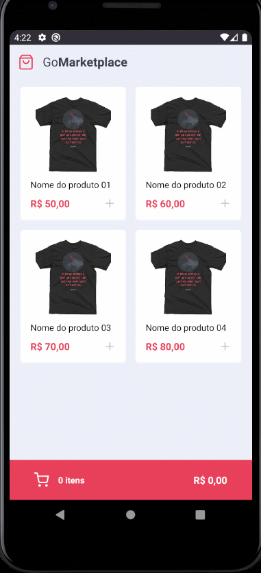

<h3 align="center">
  Challenge 08: React Native Fundamentals
</h3>

<p align="center">“There is no finish line, the victory is to keep running”!</blockquote>

<p align="center">
  

  <a href="https://rocketseat.com.br">
    
  </a>

  

  <a href="https://github.com/Rocketseat/bootcamp-gostack-desafios/stargazers">
    
  </a>
</p>

<p align="center">
  <a href="#rocket-sobre-o-desafio">About the challenge</a>&nbsp;&nbsp;&nbsp;|&nbsp;&nbsp;&nbsp;
  <a href="#memo-licença">License</a>
</p>

<p align="center">
  
</p>

## :rocket: About the challenge

In this challenge, he will develop a new application, GoMarketplace. This time it's time for you to practice what you've learned so far in React Native, along with TypeScript, using routes, Async Storage and the Context API.


Now navigate to the created folder and open it in Visual Studio Code, remember to run the `yarn` command on your terminal to install all dependencies.

### Using a fake API

First of all, so that you have the data to display on screen, we created a file that you can use as a fake API to provide you with this data.

For this, we have installed in your package.json a dependency called `json-server`, and a file called` server.json` that contains the data for a `/ products` route. To run this server you can run the following command:

```js
  yarn json-server server.json -p 3333
```

### Application layout

This application has a layout that you can follow to be able to visualize its operation.

The layout can be accessed through the Figma page, at [ link](https://www.figma.com/file/VgK3hsmyGbqiGu9FdqfUzF/GoMarketplace?node-id=0%3A1).


### Application features

Now that you have the template cloned and ready to continue, you should check the files in the `src` folder and complete where there is no code, with the code to achieve the objectives of each route.

- **`List the products of the fake API`**: Your` Dashboard` page should be able to display a listing through a table, with the `title`,` image_url` and `price` field.


- **`Add items to cart`**: In your entire application, you must use the Context called` cart` that we make available. You will need to complete the functionality inside `hooks / cart.tsx` so that you can add items to the cart.

- **`Display Cart Items`**: On the` Cart` page you should display all the items in the cart, along with the quantity, single value, subtotal value of the items and total of all items.

- **`Increase quantity of items in the cart`**: On the` Cart` page you must allow the user to increase the quantity of items of the same product, for this you can use the function `increment` within its context in` / src / hooks / cart.tsx`.

- **`Decrease quantity of an item in the cart`**: On the` Cart` page you must allow the user to decrease the quantity of items of the same product, for this you can use the function `decrement` within its context in `/ src / hooks / cart.tsx`.

- **`Show total value of items in the cart`**: Both on the` Dashboard` page and on the `Cart` page you must display the total value of all the items that are in your cart.

### Testing specification

In each test, you have a brief description of what your application must do in order for the test to pass.


Para esse desafio, temos os seguintes testes:

- **`should be able to list the products`**: For this test to pass, your application must allow all products that are returned from the Fake API to be listed on your` Dashboard` screen. This listing should display the `title` and` price` that must be formatted using the `Intl` function.

- **`should be able to add a product to the cart`**: In order for this test to pass, you must allow it to be possible to add products from your` Dashboard` to the cart, using the `cart` context provided.

- **`should be able to list the products on the cart`**: For this test to pass, you must allow it to be possible to list the products that are saved in the context of your cart on the` Cart` page, on that page display the product name, the total subtotal of each product (price \ * quantity).

- **`should be able to calculate the cart total`**: For this test to pass, both on the` Dashboard` page and on the `Cart` page, you must display the total value of all the items that are in your cart .

- **`should be able to show the total quantity of items in the cart`**: For this test to pass, both on the` Dashboard` page and on the `Cart` page you must display the total number of items that are in your cart.

- **`should be able to increment product quantity on the cart`**: For this test to pass, you must allow it to be possible to increase the quantity of a product in your cart, using the context of` cart` provided.

- **`should be able to decrement product quantity on the cart`**: For this test to pass, you must allow it to be possible to decrease the quantity of a product in your cart, using the context of the` cart` provided.

- **`should be able to navigate to the cart`**: For this test to pass, in its` FloatingCart` component on the Dashboard, you must allow that when clicking on the cart button with the testID of `navigate-to- cart-button`, the user is redirected to the `Cart` page.

- **`should be able to add products to the cart`**: For this test to pass, in your file containing the cart context, you must allow the` addToCart` function to add a new item to the cart.

- **`should be able to increment quantity`**: In order for this test to pass, in your file containing the cart context, you must allow the` decrement` function to change the quantity of a quantity by `1` unit item that is stored in context.

- **`should be able to decrement quantity`**: In order for this test to pass, in your file containing the cart context, you must allow the` decrement` function to change the quantity by one by `1` unit item that is stored in context.

- **`should store products in AsyncStorage while adding, incrementing and decrementing`**: For this test to pass, in your file containing the cart context you must allow all updates you make to the cart to be saved to AsyncStorage. For example, when adding an item to the cart, add it to AsyncStorage as well. Remember to also update the AsyncStorage value when you increase or decrease the quantity of an item.

- **`should load products from AsyncStorage`**: For this test to pass, in your file containing the cart context, you must allow all products that have been added to be fetched from AsyncStorage.


## :memo: License

This project is under the MIT license. See the archive [LICENSE](LICENSE) for more details.
